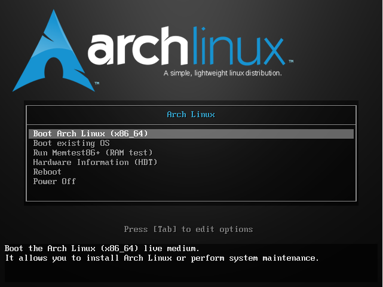
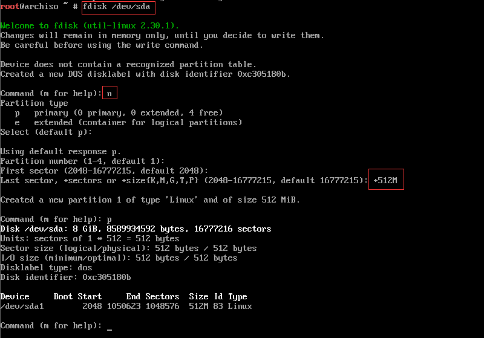
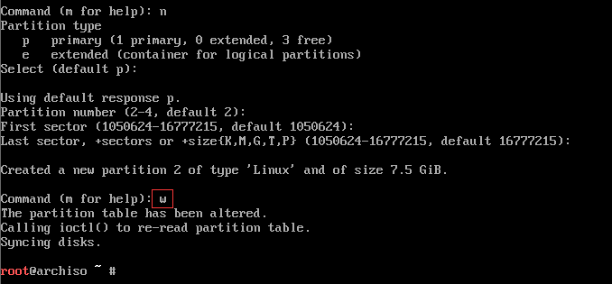
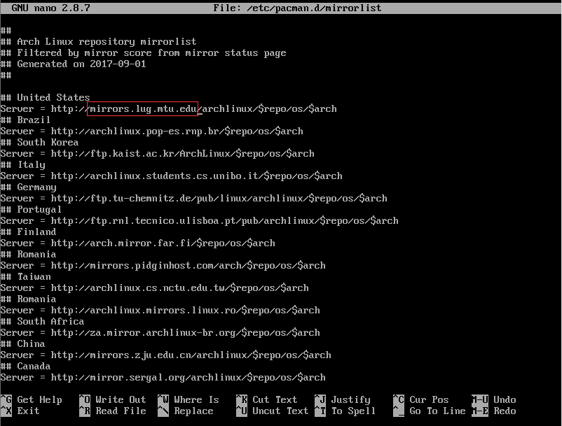
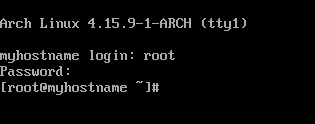

# 启动ArchLinux



选择（x86_64）既64位打开（有时称“amd64”）

>Arch Linux 现在只支持 x86_64 (有时称为amd64) 架构，对 i686 架构的支持将逐渐终结。


# 安装准备
## 测试连接到因特网
```
# ping -c 3 8.8.8.8
# ping -c 3 archlinux.org
```

## 更新系统时间
```
# timedatectl set-ntp true
```

## 建立硬盘分区
磁盘若被系统识别到，就会被分配为一个块设备，如/dev/sda。  
```
# fdisk /dev/sda
```  
```command (m for help):```  
p：查看当前分区情况  
n：新建分区  



sda1：将（+512M）分配512M的空间用作 交换分区；



sda2：剩下的全部一个区（W，保存退出）


## 格式化分区
格式化 sda1 为 swap ，用 swapon 命令激活  
```
# mkswap /dev/sda1
# swapon /dev/sda1
```
（swap是交换分区，一般设置为内存大小）

格式化 sda2 为 ext4 格式的文件系统
```
# mkfs.ext4 /dev/sda2
```

## 挂载分区
```
# mount /dev/sda2 /mnt
```
将根分区 sda2 挂载到 /mnt  


# 安装
## 选择镜像

用命令，再在顶部添加写入国内的镜像
```
# nano /etc/pacman.d/mirrorlist
```
阿里云&网易：
```
## China
Server = http://mirrors.aliyun.com/archlinux/$repo/os/$arch
## China
Server = http://mirrors.163.com/archlinux/$repo/os/x86_64
```
（可以用命令[ # pacman -Syy ]强制更新）


## 安装基本系统
执行 ```pacstrap``` 脚本，安装 ```base``` 组：
```
# pacstrap /mnt base
```
> 这个组并没有包含全部 live 环境中的程序，有些需要额外安装

P.S.:可能出现没有挂载的情况，重新挂载下就好了


# 配置系统
## Fstab
生成 ```fstab``` 文件（用 -U 或 -L 选项设置UUID 或卷标）：
```
# genfstab -U /mnt >> /mnt/etc/fstab
```
```强烈建议```：在执行完上面的命令后，检查一下生成的 ```/mnt/etc/fstab``` 文件是否正确。

## Chroot
```Change root``` 到新安装的系统：
```
# arch-chroot /mnt
```

## 时区
设置时区，例如：
```
# ln -sf /usr/share/zoneinfo/Asia/Shanghai /etc/localtime
```
调整设置```时间标准```为 UTC ，并调整```时间漂移```：
```
# hwclock --systohc --utc
```

## Locale
本地化的程序与库若要本地化文本，都依赖 ```Locale```, 后者明确规定地域、货币、时区日期的格式、字符排列方式和其他本地化标准等等。在下面两个文件设置：```locale.gen``` 与 ```locale.conf```.

```/etc/locale.gen``` 是一个仅包含注释文档的文本文件。指定您需要的本地化类型，只需移除对应行前面的注释符号（＃）即可，建议选择帶UTF-8的項：
```
# nano /etc/locale.gen

...
en_US.UTF-8 UTF-8
...
zh_CN.UTF-8 UTF-8
zh_TW.UTF-8 UTF-8
...
```
接着执行 ```# locale-gen``` 以生成 locale 讯息.

```/etc/locale.gen``` 生成指定的本地化文件，每次 glibc 更新之后也会运行 locale-gen。

创建 locale.conf 并提交您的本地化选项：
> Tip: 将系统 locale 设置为en_US.UTF-8，系统的 Log 就会用英文显示，这样更容易问题的判断和处理。
```
# echo LANG=en_US.UTF-8 > /etc/locale.conf
```

## 主机名
要设置 ```hostname```，将其添加 到 ```/etc/hostname```, myhostname 是需要的主机名:
```
# echo myhostname > /etc/hostname
```
建议添加对应的信息到 hosts:
```
/etc/hosts

127.0.0.1	localhost.localdomain	localhost
::1		localhost.localdomain	localhost
127.0.1.1	myhostname.localdomain	myhostname
```

## Initramfs
如果修改了 ```mkinitcpio.conf```，用以下命令创建一个初始 RAM disk：
```
# mkinitcpio -p linux
```

## Root 密码
设置 ```root``` 密码:
```
# passwd
```
加上用户名字做变量，可设置用户密码

## user 设置
添加用户 user1
```
# useradd -m -g users -s /bin/bash user1
```

## 安装引导程序
下载 [启动加载器](https://wiki.archlinux.org/index.php/Boot_loaders_(%E7%AE%80%E4%BD%93%E4%B8%AD%E6%96%87)) GRUB  
把GRUB安装在硬盘 sda 上，然后自动配置 GRUB
```
# pacman -S grub
# grub-install --recheck /dev/sda
# grub-mkconfig -o /boot/grub/grub.cfg
```
因为使用Intel CPU，所以还需要安装 ```intel-ucode``` 并 ```启用英特尔微码更新```
```
# pacman -S intel-ucode
```

**自动方法**  
*grub-mkconfig*会自动检测微码更新并适当地配置```GRUB```。安装 *intel-ucode* 软件包后，重新生成GRUB配置文件，通过运行以下命令来激活加载微码更新：

```
# grub-mkconfig -o /boot/grub/grub.cfg
```
**手动方法**  
或者，手动管理其```GRUB```配置文件的用户可以添加```/intel-ucode.img```或```/boot/intel-ucode.img```如下所示：
```
/boot/grub/grub.cfg
...
echo 'Loading initial ramdisk'
initrd	/intel-ucode.img /initramfs-linux.img
...
```


# 重启
输入 ```exit``` 或按 ```Ctrl+D``` 退出 chroot 环境。

可选用 ```umount -R /mnt``` 手动卸载被挂载的分区：这有助于发现任何“繁忙”的分区，并通过 ```fuser(1)``` 查找原因。

最后，通过执行 ```reboot``` 重启系统：*systemd* 将自动卸载仍然挂载的任何分区。不要忘记移除安装介质，然后使用root帐户登录到新系统。



***
OK，安装成功！
