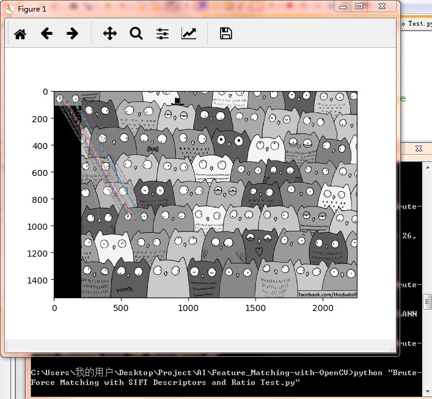

```stackoverflow.com 是个好社区 ```
# 使用ORB描述符进行穷举匹配
> ```"Brute-Force Matching with ORB Descriptors.py"```    


***
```matches = bf.match(des1，des2)``` 行的返回值是DMatch对象的一个列表。  
该DMatch对象具有以下属性：  
- DMatch.distance - 两个描述子之间的距离。数值越低越好。
- DMatch.trainIdx - train描述子的索引
- DMatch.queryIdx - query描述子的索引
- DMatch.imgIdx - 匹配图像的索引。

***

```
Traceback (most recent call last):
    img3 = cv2.drawMatches(img1,kp1,img2,kp2,matches, flags=2)
TypeError: Required argument 'outImg' (pos 6) not found
```
```
>>> cv2.drawMatches.__doc__
`cv2.drawMatches(img1, keypoints1, img2, keypoints2, matches1to2, outImg[, matchColor[, singlePointColor[, matchesMask[, flags]]]]) -> outImg\n.   @overload`
```
解决办法：
```
img3 = cv2.drawMatches(img1,kp1,img2,kp2,matches,None, flags=2)
```
***

# 使用SIFT描述符和比值审敛法进行穷举匹配
> ```"Brute-Force Matching with SIFT Descriptors and Ratio Test.py"```  



***
```sift = cv2.SIFT()``` 是Python2.x中的API  
在Python3.x中使用需要新的API：  
```sift = cv2.xfeatures2d.SIFT_create()```

***
```
Traceback (most recent call last):
    img3 = cv2.drawMatchesKnn(img1,kp1,img2,kp2,good, flags=2)
TypeError: Required argument 'outImg' (pos 6) not found
```
```
>>> cv2.drawMatchesKnn.__doc__
'drawMatchesKnn(img1, keypoints1, img2, keypoints2, matches1to2, outImg[, matchC
olor[, singlePointColor[, matchesMask[, flags]]]]) -> outImg\n.   @overload'
```
解决办法同上（加 None, ）


# 基于FLANN的匹配器
> ```"FLANN based Matcher.py"```  


***
对于基于FLANN的匹配器，我们需要传递两个字典来指定要使用的算法及其相关参数等。  
首先是```IndexParams```。对于各种算法，要传递的信息在FLANN文档中进行了解释。总结一下，对于像SIFT，SURF等算法，可以传递以下内容：
```
index_params = dict(algorithm = FLANN_INDEX_KDTREE, trees = 5)
```
第二个字典是```SearchParams```。它指定了索引中的树应递归遍历的次数。值越高，精度越高，但也需要更多时间。
```
search_params = dict(checks=100)
```